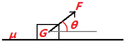
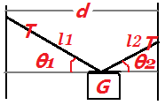

# 物理
[TOC]
## 结论

#### 两物体发生弹性碰撞

若物块 $A$ 以速度 $v_1$ 在光滑平面上撞向另一静止的物块 $B$，发生弹性碰撞，则可根据动量守恒和能量守恒解得
$$
v_1'=\frac{m_1-m_2}{m_1+m_2}v_1\\
v_2'=\frac{2m_1}{m_1+m_2}v_1
$$
其中 $v_1'$ 代表碰撞后的物块 $A$ 的速度， $v_2'$ 代表碰撞后的物块 $B$ 的速度，依据上式我们可以得到下述三种情况
$$
\ \ 当\ m_1=m_2\ 时，v_1'=0,v_2'=v_1\quad(交换)\\
\ \ 当\ m_1>m_2\ 时，v_1'>0,v_2'>0\ \ \quad(推挤)\\
\ \ 当\ m_1<m_2\ 时，v_1'<0,v_2'>0\ \ \quad(反弹)
$$
若两物体都在运动，能发生弹性碰撞，且 $v_1>v_2$ ，则碰撞后有
$$
v_1'=\frac{m_1-m_2}{m_1+m_2}(v_1-v_2)+v_2\\
v_2'=\frac{2m_1}{m_1+m_2}(v_1-v_2)+v_2
$$
**无论什么情况，只要发生了弹性碰撞，且两物体质量相等，则两物体碰撞前后速度交换**

#### 光电效应中的电流表示数

实验原理图如下：

根据光电效应，当入射光频率大于或等于金属的极限频率时，金属会溢出电子，而入射光强度越大，单位时间内溢出的电子数越多，所以当金属发生光电效应时，光强决定了上面实验装置的光电流大小。**若保持入射光强度不变，在入射光频率大于极限频率后继续提高入射光频率，则电流表 $\rm{\mu A}$ 的示数不会增大，可能会减小。**原因如下：

由光电效应方程 $h\nu=\frac{1}{2}mv_{max}^2+W_0$ ，$\nu$ 越大， $v_{max}$ 越大，当 $v_{max}$ 大到一定程度，部分电子可能无法聚集在阴极板 $A$ ，导致光电流减小。

#### 原子衰变产生的三种粒子

|   名称   |      $\alpha$ 粒子       |  $\beta$ 粒子  | $\gamma$ 粒子 |
| :------: | :----------------------: | :------------: | :-----------: |
|   实质   | 氦原子核 $_2^4\rm{He}^+$ | 电子 $\rm e^-$ |     光子      |
| 穿透能力 |            弱            |       中       |      强       |
| 电离能力 |            强            |       中       |      弱       |

##### 两种原子衰变

###### 衰变的方程式

$\alpha$ 衰变：$\rm{2\ _1^1H\ + 2\ _0^1n \to\ _2^4He}$

$\beta$ 衰变：$\rm{_0^1n \to_{-1}^{\  \ 0}e +\ _1^1H}$

###### 判断衰变的次数

若 $\rm{_m^nA}$ 衰变为 $\rm{_p^qB}$

则 $\frac{n-q}{4}$ 为 $\alpha$ 衰变的次数， $p+\frac{n-q}{2}-m$ 为 $\beta$ 衰变次数

###### 衰变产生的粒子在磁场中的运动轨迹

$\alpha$ 衰变：由于衰变后两粒子都带正电相互排斥，所以其运动轨迹如下

**$\alpha$ 衰变产生氦核，其中大圆为氦核运动轨迹，小圆为另一个原子核的运动轨迹。**

带电粒子在磁场中做匀速圆周运动，其轨道半径为 $r=\frac{mv}{qB}$ ，因为衰变前粒子静止，衰变后产生的两个粒子的动量 $p=mv$ 相同，所以电荷量 $q$ 越小， $r$ 越大。一般来说，衰变后产生的氦核电荷量较小，所以其轨道半径较大。

$\beta$ 衰变：由于衰变后两粒子都带异种电荷相互吸引，所以其运动轨迹如下

**$\beta$ 衰变产生电子，其中大圆为电子运动轨迹，小圆为另一个原子核的运动轨迹。**

与 $\alpha$ 衰变同理，电子的电荷量小，所以其轨道半径较大。

#### 近代物理结论汇总

1. 大量物体或波长越长容易表现为波动性，个别物体或频率越高容易表现为粒子性。

2. 核聚变过程中，聚变后的原子的比结合能一定比聚变前的原子的比结合能大。

3. 比结合能越高的原子越稳定。

4. 原子衰变产生的 $\alpha,\beta,\gamma$ 粒子均来自原子核内部。

5. 放射性同位素半衰期短，环境污染小，但不适合用作核燃料。

6. 地壳中的一些半衰期很短的物质，主要源于其它放射性物质的衰变。

#### 水银管移动问题

如下图所示，两端封闭的玻璃管中间有一段水银柱将管内气体分为左右两部分，左端气体温度 $T_a$ 大于右端气体温度 $T_b$ ，状态稳定。现使两端气体升高相同温度，则水银柱向哪一端移动？

**分析：**

稳定时， $P_a=P_b$ 且 $n_a,n_b$ 一定，移动瞬间 $V_a,B_b$ 不变，根据理想气体方程 $Pv=nRT$ 有

$P_0T_1=P_1T_0$ ，变形得 $T_0\Delta P=P_0\Delta T$ ，由于 $P_0\Delta T$ 一定，$T_0$ 大则 $\Delta P$ 小，因为两端气体压强相等时才能恢复稳定，所以水银柱会往 $\Delta P$ 小的一端移动，也就是往左端移动。

根据公式 $\Delta P=\frac{P_0}{T_0}\Delta T$ 推广之，可以得到下面的结论：

**升高相同温度，水银柱向初始温度高的一端移动或向初始压强低的一端移动，与其它因素无关。**

什么是向初始压强低的一端移动？假设上面的玻璃管两端初始温度相同，但是玻璃管倾斜放置，于是在重力的作用下，玻璃罐上端气体压强会比下端气体压强低，当两端升高相同温度，水银柱会向上端移动。

#### 质心等效法

在某些情况下，我们可以把多个物体看作系统来分析问题，这时我们往往需要找到系统的质心。两质点到系统质心的距离与其各自质量的乘积相等。即
$$
m_1x_1=m_2x_2
$$
这个公式是普适的，对于杠杆问题，动量问题，双星问题等都适用。

###### 例1

如下图所示，一光滑轻杆沿水平方向放置，左端 $O$ 处连接转动轴， $a,b$ 为两个可视为质点的小球，串在轻杆上。用细线连接 $O_a,O_b$，且 $O_a=O_b$ ，$b$ 球质量为 $a$ 的 $3$ 倍，当轻杆绕着 $O$ 点匀速转动时，细线 $O_a,O_b$ 的拉力比为多少？

**分析：**

可以设 $a$ 的质量为 $1$，$b$ 的质量为 $3$，根据质心公式 $m_1x_1=m_2x_2$ ，可以找到 $a,b$ 的质心 $O'$ ，$aO'$ 和 $bO'$ 分别为 $3$ 和 $1$ 。如下图所示

将 $a,b$ 看作整体，则有 $F_{Oa}=(m_a+m_b)\omega^2x_{OO'}$

单看 $b$ ，则有 $F_{ab}=m_b\omega^2x_{Ob}$

因为角速度相同，代入数据可得
$$
\frac{F_{Oa}}{F_{ab}}=\frac{(m_a+m_b)\omega^2x_{OO'}}{m_b\omega^2x_{Ob}}=\frac{(1+3)\times(4+3)}{3\times8}=\frac{7}{6}
$$

#### 传送带热量问题

对于下图所示的传送带，物块通过传送带，要考虑物块**能否运动到末端**，若不能，物块在**什么时候会在传送带上匀速运动**，物块与传送带的**相对位移**是多少。物块在传送带上产生的摩擦热就是滑动摩擦力与相对位移的乘积。

###### 例1

水平传送带长为 $L=10m$，以 $v_0=4m/s$ 的速度顺时针匀速转动，将一质量为 $m=1kg$ 的小物体无初速释放在传送带的左端，小物体与传送带间动摩擦因数 $μ=0.1$ ，求物体在传送带上产生的热量。$(g=10m/s^2)$

**分析：**

物体加速过程的加速度 $a=\frac{\mu mg}{m}=1m/s^2$

加速到 $v_0$ 时，时间 $t=\frac{v_0}{a}=4s$

此时物体的位移 $x_1=\frac{1}{2}at^2=8m$

传送带长度 $L>x$，因此物体会继续向前做匀速运动

在加速期间，传送带的位移 $x_2=v_0t=16m$

可知物体与传送带的相对位移 $s=x_2-x_1=8m$

因此摩擦生热 $Q=\mu mgs=8J$

#### 推导动量守恒

如何从已学的牛顿力学来推导动量守恒？教材没讲，老师没教。这里给出推导过程。

两物体 $m_1$ 和 $m_2$ 在任意一段极短的时间 $\Delta t$ 内相互作用，相互作用力可以看为恒力，设 $m_1$ 给 $m_2$ 的力为 $F$
根据牛顿第二定律有
$$
F=m_2a_2\ 故\ a_2=\frac{F}{m_2}
$$
根据牛顿第三定律有
$$
-F=m_1a_1\ 故\ a_1=-\frac{F}{m_1}
$$
则有
$$
m_1\Delta v_1=m_1a_1\Delta t=-F\Delta t\\
m_2\Delta v_2=m_2a_2\Delta t=F\Delta t
$$
两式相加得
$$
m_1\Delta v_1+m_2\Delta v_2=0
$$
于是，两物体组成的系统在 $\Delta t$ 时间内动量守恒，因此，由 $\Delta t$ 构成的任何一段时间内动量守恒

#### 粗糙平面拉力最小值问题

如下图，木块在水平面上匀速运动，粗糙平面动摩擦因数为 $\mu$ ，木块重力为 $G$ ，一斜向上大小为 $F$ 的拉力与水平面夹角为 $\theta$ 。当夹角多大时拉力最小，最小为多少？

**分析：**

以为处于平衡状态，正交分解后，水平方向上的合力与竖直方向上的合力为零，可以得到
$$
F\cos\theta=f=\mu F_N\\
F\sin\theta+F_N=G\\
$$
整理一下得到
$$
F(\mu\sin\theta+\cos\theta)=\mu G
$$
由辅助角公式 $\mu\sin\theta+\cos\theta=\sqrt{\mu^2+1}\cos(\theta-\varphi)$ ，当其取最大值 $\sqrt{\mu^2+1}$ 时，有拉力 $F$ 最小值
$$
F_{min}=\frac{\mu G}{\sqrt{\mu^2+1}}
$$
此时 $\theta=\varphi$ ，所以 $\mu=\tan\theta$

#### 轻绳中间挂重物类问题

如下图，两木杆相距为 $d$ ，一根长为 $L$ 绳子两端固定在杆上，中间用光滑的滑轮挂着一个重力为 $G$ 的木块。如果绳子右端上移，绳子的张力会如何变化？如果右边的木杆右移，绳子的张力又会怎样变化？

**分析：**

**绷紧的绳上一点，沿绳的两个方向张力相同**，因此滑轮两边所受绳的拉力都是 $T$ 。因为系统处于平衡状态，水平方向上合力为零，有 $T\cos\theta_1=T\cos\theta_2$，所以 $\theta_1=\theta_2$。竖直方向上合力为零，有 $T\sin\theta_1+T\sin\theta_2=G$ ，即 $T=\frac{G}{2\sin\theta}$。对于绳长，有 $l_1\cos\theta_1+l_2\cos\theta_2=d$ ，即 $L=l_1+l_2=\frac{d}{\cos\theta}$ 。

综上可以发现，绳子的张力 $T$ 只与重力 $G$ 、木杆间距离 $d$  和绳长 $L$ 有关，所以绳子右端上移，绳子的张力不变，而右移右边的木杆，绳子的张力变大。

#### 物体受多个力在圆弧上运动

**物体受多个力在圆弧上缓慢运动，沿圆心方向的力往往恒定**。可以由相似三角形进行分析。此条结论待定。

## 技巧

###### 例1

(2019 全国卷Ⅲ, 21) 如图，电荷量分别为 $q$ 和 $–q\ (q>0)$ 的点电荷固定在正方体的两个顶点上， $a,b$ 是正方体的另外两个顶点。则

 A．$a$ 点和 $b$ 点的电势相等
 B．$a$ 点和 $b$ 点的电场强度大小相等
 C．$a$ 点和 $b$ 点的电场强度方向相同
 D．将负电荷从 $a$ 点移到 $b$ 点，电势能增加

**分析：**

如下图所示，连接矩形和其对角线，对角线交于 $O$ 点，易知 $a$ 点， $O$ 点和 $-q$ 所成角为锐角。

由此可以画出矩形平面内的电场线分布，如下图

**关于异种电荷所连直线对称的点，电势相等**，由于 $a,b$ 两点所连直线不垂直于异种电荷所连直线，因此电势不相等。A选项错误。

**关于异种电荷所连线段中点对称的点，电场强度大小和方向都相等**。由于 $a,b$ 两点关于 $O$ 点对称，所以 $a$ 点和 $b$ 点的电场强度大小方向相同。B、C选项正确。

根据对称性，将 $b$ 点对称到 $c$ 点，负电荷从 $a$ 点移动到 $c$ 点，电场力做正功，电势能减小。D选项错误。

## 其它

暂无